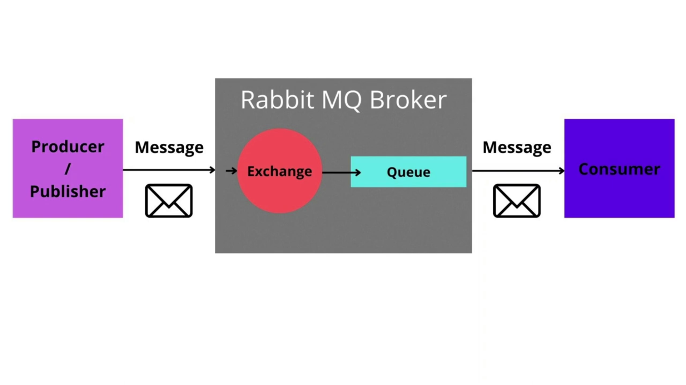

# Rabbit MQ 🐰

## What is Rabbit MQ? 🤔

> It is a messsge broker software that implements the Advanced Message Queuing Protocol (AMQP)

- a message broker is a software that allows applications/microservices to communicate with each other and exchange informations && the broker is the software that recives the messages and routes them to the correct destination(specified queue)

  

  - the producer(publisher) is the application that sends the message to the broker
  - the consumer(subscriber) is the application that recives the message from the broker
  - the broker consists of an exchange and a queue:
    - the exchange is the component that recives the message from the producer and routes it to the correct queue
    - the queue is the component that stores the message until it is consumed by the consumer

## Adventages of using Rabbit MQ

- when a message is sent to the broker, it is stored in a queue until it is consumed by the consumer even if the consumer was down for any reason

- messages can be acknowledged , it allows to send an acknowledgement packet to the producer to confirm that the message was recieved :

  - that helps to gerantee that the message was recieved by the consumer successfully and when it was recieved
  - if the acknowledgement is not recieved by the producer, the producer will resend the message to the broker and if it was already recieved the message will be deleted from the queue

- messages can be persisted, it allows to store the messages in the disk instead of the memory, so if the broker is restarted the messages will not be lost

## Exchange types

> ### 1- Fanout exchange
>
> - in this exchange type, the message is sent to all the queues that are bound to the exchange
>
>   
>
>   - the producer sends the message to the exchange
>   - the exchange sends the message to all the queues that are bound to it

> ## Example on the Fanout exchange
>
> 
>
> - in this example above, the transactions service which is the producer sends a message to the exchange with the transaction details and the fonaut exchange recives that message and sends it to all the queues whiach are the SMS queue , Email queue and the pdf queue
>
> - and those messages are consumed by the services that are bound to those queues
>   - the SMS service consumes the message from the SMS queue
>   - the Email service consumes the message from the Email queue
>   - the pdf service consumes the message from the pdf queue

> ### 2- Direct exchange
>
> in this exchange type, the message is sent to the queue that is bound to the exchange and has the same routing key as the message
>
> 
>
> - the producer sends the message to the exchange with a routing key
> - the exchange sends the message to the queue that is bound to it and has the same routing key as the message

> ## Example on the Direct exchange:
>
> 
>
> - in the example above the logger which is the producer sends a message with the log details and a routing key, to the exchange
> - the exchange recives the message and sends it to the queue that is bound to it and has the same binding key as the routing key that sent with the message
> - take a closer look at the binding key of the information service queue, it is the same as the routing key that was sent with the message so that the message sent to the info service queue and consumed by the info service

> ### 3- Topic exchange
>
> in this exchange type, the message is sent to the queue that is bound to the exchange and has the same routing key as the message or has a routing key that matches the routing key of the message
>
> 
>
> in this example the producer sends a message with the routing key (pattern) to the exchange and the exchange sends the message to the queue that is bound to it and has the same routing key as the message or has a binding key that matches the routing key of the message
>
> - the binding key can have two wildcards:
>
>   - "\*" : matches exactly one word
>   - "#" : matches zero or more words

# Using Rabbit MQ with this project
